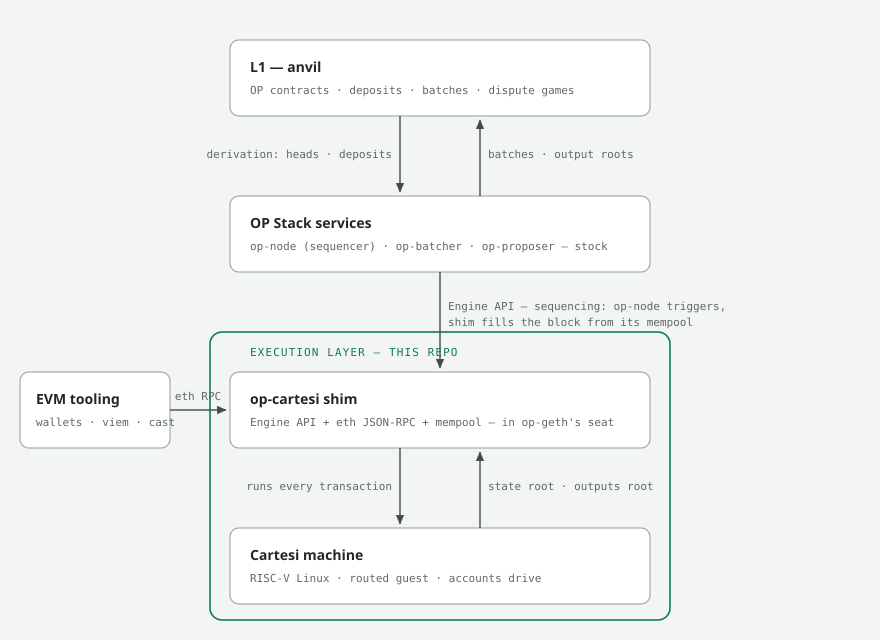
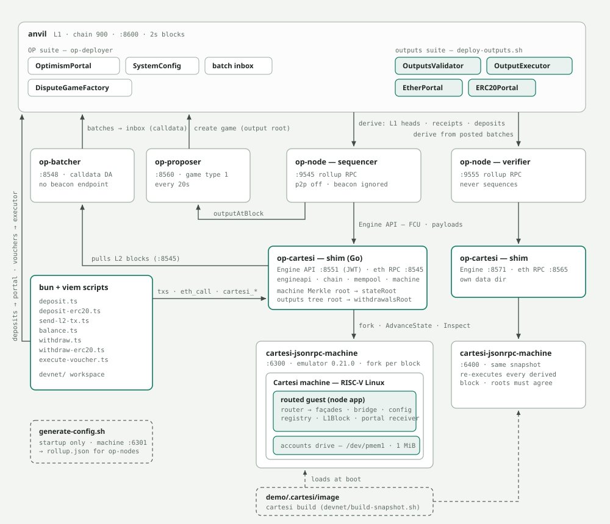
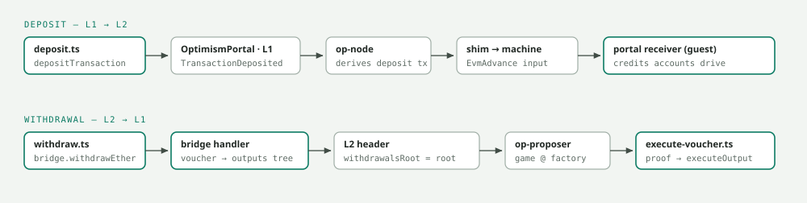

# Cartesi Machine as an L2 Execution Layer

**Goal:** run a chain whose state transition function is a Cartesi Machine (RISC-V, Linux) instead of an EVM, while writing as little new code as possible — reusing mature components for L1 interaction, sequencing, data availability, derivation, and dispute resolution.

**TL;DR:** The OP Stack is the right donor. It has two clean, already-exploited seams: the **[Engine API](https://specs.optimism.io/protocol/overview.html#engine-api)** boundary between `op-node` and the execution engine (precedent: Monomer put a Cosmos SDK app behind it), and the **[DisputeGameFactory](https://specs.optimism.io/fault-proof/stage-one/dispute-game-interface.html#disputegamefactory-interface)** game-type registry on L1 (precedent: Cannon, Asterisc, OP Succinct, and Kailua all coexist as registered game types on the same contracts). Arbitrum Nitro has no equivalent seams — its STF *is* Geth+ArbOS compiled into the WAVM replay binary, so swapping the execution layer means forking the heart of Nitro. One new component does the whole job: an Engine API shim that speaks the Engine API to `op-node` and CMIO to the machine.

**Where this stands.** Everything from §3 through §7 is built and running: the shim sequences and verifies, the chain persists and restarts, and both directions of the ether and ERC-20 bridges run on stock OP contracts. What is *not* solved is §8 — proving the computation, so that a proposal can be disputed. Proposals go into OP's permissioned game type and nobody can challenge them; that is the chain's one remaining trust assumption, and §8 explains exactly what closing it requires.

**How to read this.** §1–§2 are the reuse argument: what the machine gives you, and why the OP Stack is the chassis. §3 is the shim. §4–§7 are the chain as it works today — commitments, bridging, persistence. §8 is the open problem. §9 is where the design can go next.

---

## 1. What the Cartesi Machine actually provides

Reading `machine-emulator` (`main` as of July 2026), the relevant capability surface for an L2 execution layer is:

**Deterministic RV64GC machine with a Merkleized state.** The emulator implements the full RISC-V RV64GC ISA (privileged + unprivileged), boots Linux, and is deterministic down to floating point. The entire 64-bit physical address space is committed to a hash tree; `src/cm.h` exposes `cm_get_root_hash()`, `cm_get_node_hash()`, and `cm_get_proof()` for Merkle proofs of any word/range against the root. This root hash is a natural **L2 output root / state root**.

**A rollup-shaped I/O boundary (CMIO).** `cm_receive_cmio_request()` / `cm_send_cmio_response()` implement a yield-based input/output protocol: the guest yields, the host feeds it an input, the guest emits outputs — exactly the advance-state loop Cartesi Rollups applications already use. Critically, `cm_send_cmio_response` has a logged counterpart, `cm_log_send_cmio_response()` + `cm_verify_send_cmio_response()`, so *feeding an input is itself a provable state transition*.

**Provable stepping at two granularities.**
- `cm_log_step(m, mcycle_count, ...)` + `cm_verify_step()` — logs/verifies a big-step transition over N machine cycles (the "computation hash" / step-log machinery).
- `cm_log_step_uarch()` / `cm_verify_step_uarch()` + `cm_log_reset_uarch()` — the microarchitecture: the emulator's own interpreter compiled to a tiny RISC-V core whose single step is small enough to replay **on-chain in Solidity** (the `cartesi/machine-solidity-step` repo). This is the leaf of Cartesi's interactive fraud proofs (Dave/PRT).

**A ZK path, in-repo.** The `risc0/` directory contains a working RISC Zero prover pipeline: `cartesi-risc0-cli prove <hash_before> step.log <mcycle> <hash_after>` produces a STARK receipt, compressible to a **Groth16 seal (~260 bytes, ~300k gas)** verified on-chain via the RISC Zero Verifier Router; Solidity integration lives in `risc0/solidity/`. So a machine state transition can be settled either interactively (uarch replay) or with a single ZK proof.

**Operational machinery a node needs.** Forking and rollback (`cm_clone_*`, revert-root-hash APIs, snapshots via `cm_store`/`cm_load`), a JSON-RPC remote machine server (`cm-jsonrpc.h`) so the machine can run as a separate process, freestanding/WASM compilation targets, and a C API designed for FFI.

The one thing it is **not**: an Ethereum execution client. No blocks, no transactions, no receipts, no `eth_*` RPC, no mempool. Everything below is about bridging that gap with as thin a layer as possible, and reusing everything else.

---

## 2. Why the OP Stack, and not Nitro

### OP Stack — two designed-in seams

The OP Stack splits an L2 node into a **consensus/rollup node** (`op-node`, or the Rust `kona-node`) and an **execution engine**, connected by the (slightly extended) Ethereum **[Engine API](https://specs.optimism.io/protocol/exec-engine.html#engine-api)**: `op-node` [derives the L2 chain from L1](https://specs.optimism.io/protocol/derivation.html#l2-chain-derivation-pipeline) (batches + deposits), then drives the engine with `engine_forkchoiceUpdated` / `engine_getPayload` / `engine_newPayload`. The engine is explicitly pluggable — op-geth, op-reth, op-erigon all sit behind the same interface, and **Monomer (Polymer/Nethermind) proved the seam works for non-EVM engines** by translating Engine API ↔ ABCI so Cosmos SDK apps run as the OP Stack execution layer. (Monomer is paused, but it's a working, readable Go reference for exactly the adapter you need.)

On L1, the settlement side is equally pluggable: `OptimismPortal` validates [withdrawals](https://specs.optimism.io/protocol/withdrawals.html) against outputs proposed through the **DisputeGameFactory**, which dispatches by [`GameType`](https://specs.optimism.io/fault-proof/stage-one/dispute-game-interface.html#types). The deployed registry already includes `CANNON` (MIPS FPVM), `ASTERISC`/`ASTERISC_KONA` (RISC-V FPVM), `OP_SUCCINCT` (SP1 validity proofs), and `KAILUA` (RISC Zero hybrid ZK fraud/validity proofs). Adding a game type is a supported, production-exercised extension point — you deploy a new game implementation and register it; the portal, factory, batcher, proposer, and challenger tooling stay stock.

Around those seams, the reusable inventory is large: `op-batcher` (calldata/blob batch submission, compression, channel framing), `op-proposer` (posts output roots / creates games), `op-challenger` (dispute participation framework), `op-conductor` (HA sequencer failover), `op-deployer`, the bridge contract suite, and op-node's built-in sequencer mode with unsafe-head P2P gossip. That is the "Ethereum interaction + sequencer" subsystem, off the shelf.

### Arbitrum Nitro — one binary, no seam

Nitro's architecture is the "Geth sandwich": Geth core at the bottom, ArbOS in the middle (batch parsing, L1 fee accounting, bridging, block production), node software on top — and the **STF is defined as this Go code compiled to a WAVM replay binary**, whose Merkle root (`wasmModuleRoot`) is pinned in the L1 rollup contract for fraud proofs. Execution, derivation, and proving are one artifact. Arbitrum's own docs on customizing the STF describe it as "build a modified Nitro node Docker image" and warn that any change produces a new module root requiring coordination with Offchain Labs.

To put a Cartesi Machine here you would have to replace the Geth+ArbOS core inside Nitro *and* make the result compile to WAVM for BoLD-style disputes (the emulator is C++; the replay binary toolchain is Go→WASM), or replace the prover too — at which point you're rewriting the subsystems you wanted to reuse. Stylus doesn't help: it's a WASM contract runtime *inside* the EVM chain, not an alternative execution layer. **Nitro fails the "write as little code as possible" test**, and nothing in it is worth extracting that the OP Stack doesn't offer with a cleaner boundary.

---

## 3. The Engine API shim

This is the one genuinely new component, and it's Monomer-shaped: a service that speaks the Engine API plus a minimal `eth_*` subset to `op-node` on one side, and the Cartesi Machine JSON-RPC / C API on the other. Its responsibilities:

1. **Block production** (`engine_forkchoiceUpdatedV3` with payload attributes → `engine_getPayloadV4`): take the attributes from op-node — timestamp, L1-origin info, and the mandatory deposit transactions — plus pending user transactions from its own tiny mempool (`eth_sendRawTransaction`; there is no public L2 mempool in the OP Stack, so the sequencer's shim is the only ingress). Feed each item into the machine as a CMIO input, run to the next yield, then synthesize an L2 block: an Ethereum-shaped header whose `stateRoot` is `cm_get_root_hash()` and whose `withdrawalsRoot` is the withdrawal trie root (§5).
2. **Block import** (`engine_newPayloadV4`): verifiers replay the same inputs into their machine and check the resulting root hash and withdrawal commitment against what the payload claims. This is what makes derivation-from-L1 work identically on every node.
3. **Fork choice and reorgs**: map `forkchoiceUpdated`'s unsafe/safe/finalized heads onto machine snapshots. This is where the emulator's fork/rollback and `cm_store`/`cm_load` APIs earn their keep: keep periodic snapshots keyed by block hash, roll back on L1 reorg.
4. **Deposit semantics**: op-node injects the [L1-attributes deposit](https://specs.optimism.io/protocol/deposits.html#l1-attributes-deposited-transaction) and [user deposits](https://specs.optimism.io/protocol/deposits.html#user-deposited-transactions) (ETH/token bridge mints) as the first transactions of every block. The guest inside the machine parses and honors them — crediting balances, recording L1 block info — which is what makes the standard bridge sound. This mirrors Cartesi Rollups' InputBox/portal pattern, just arriving in OP's deposit-transaction encoding, which the guest ABI-decodes like any other input.
5. **A minimal `eth_*` surface** for op-node, op-batcher and op-proposer, plus the subset ordinary wallets need. Everything genuinely machine-shaped is served under a `cartesi_*` namespace instead of being faked as EVM state.

The leverage is the point: **op-node, op-batcher, op-proposer, op-conductor, sequencer mode, P2P, blob DA, and the entire derivation pipeline come for free once this shim exists.**



*The shim's seat, as the devnet runs it. Sequencing is a split job: op-node
triggers block production over the Engine API and pins the deposits; the shim
fills the rest of the block from its own mempool and computes it in the
machine, returning the machine Merkle root as `stateRoot` and the withdrawal
trie root as `withdrawalsRoot`. The full runtime, process by process:*



*Accent-stroked boxes are this repo's code (shim, routed guest, scripts,
outputs contracts); plain boxes are stock tooling (OP Stack, foundry, the
emulator); dashed boxes are startup-time artifacts. The verifier column is
the rollup property made visible: it rebuilds the same chain from nothing
but what the batcher posted to L1.*

### Input granularity: one input per transaction, in Cartesi's envelope

Each transaction is one CMIO input, wrapped in

    EvmAdvance(chainId, appContract, msgSender, blockNumber, blockTimestamp, prevRandao, index, bytes payload)

with the raw transaction as the payload. This is the encoding Cartesi's guest tools already decode, so a stock guest-tools rootfs and existing Cartesi applications run unmodified — the same reuse argument that picked the OP Stack.

The alternative — one input per block carrying the ordered transaction list — means fewer yields and block-atomic execution, but composes worse with existing Cartesi tooling and with the dispute story of §8, which indexes inputs individually. Feeding raw transaction bytes with no envelope was tried and fails against a stock guest: the guest cannot parse them, exits, and halts the machine.

The envelope also carries the L2 block context, which the machine has no other way to learn — it has no clock and no view of the chain. Indices are chain-wide, so the guest sees one gapless input sequence as it would from an InputBox. Every field is derivable from the block header, so a verifier re-executing a block reconstructs the builder's context exactly.

---

## 4. Outputs, reports, inspect — and what becomes a receipt

The Cartesi Machine's I/O model has three concepts that look receipt-shaped but are not interchangeable. They map to **three different places** in the OP Stack, and getting the split right is what determines the withdrawal path.

| Cartesi concept | Nature | OP Stack / Ethereum counterpart |
|---|---|---|
| **Output — voucher** (`tx-output`; an executable call on L1) | provable, committed | **[Withdrawal](https://specs.optimism.io/protocol/withdrawals.html#the-l2tol1messagepasser-contract)** (an L2ToL1MessagePasser message). Belongs in the *output root*, not in a receipt. |
| **Output — notice** (a provable statement) | provable, committed | Ethereum **log / event**. Belongs in the receipt *and* in the outputs commitment. |
| **Report** (`tx-report`) | explicitly **not** provable | Receipt **status, revert reason, debug payload**. Must never enter a commitment. |
| **Inspect** (`CmioRxRequestInspectState`) | read-only, no state change | **`eth_call`**. Not a receipt concern at all. |

In Cartesi Rollups, outputs accumulate into an **outputs Merkle root** — that root is what gets claimed on L1 and what `executeVoucher`/output validation proves against. In the OP Stack the structural analogue is the `messagePasserStorageRoot` inside

```
OutputRootV0 = keccak(version, stateRoot, messagePasserStorageRoot, blockHash)
```

which is exactly what `op-proposer` [posts](https://specs.optimism.io/protocol/proposals.html#l2-output-commitment-construction) and what `OptimismPortal` checks withdrawals against.

### Isthmus is not optional

op-node builds that output root in `L2Client.outputV0`, and it has two paths:

- **Pre-Isthmus:** `eth_getProof(L2ToL1MessagePasser, [], blockHash)`, then `proof.Verify(block.Root())` — an MPT proof of a specific *account* against the block's state root.
- **[Isthmus](https://specs.optimism.io/protocol/isthmus/exec-engine.html#l2tol1messagepasser-storage-root-in-header):** reads `block.WithdrawalsRoot()` directly from the header.

**The pre-Isthmus path is unimplementable for a Cartesi execution layer.** It requires a genuine Ethereum MPT state trie containing an account at a fixed address, provable against the state root. This chain's state root is a Cartesi hash-tree root over the machine's address space; there is no account trie and no such account. Producing a proof that verifies is impossible, and faking one would be worse than not having it.

So **Isthmus is not merely "the next fork we haven't implemented"; it is the fork that makes `op-proposer` work for a non-EVM execution layer.** A pre-Isthmus chain could never be proposed, which is why the fork schedule here is fixed rather than configurable: every fork through Isthmus is active from genesis, and the pre-Isthmus paths are not implemented at all. The cost is bounded and known:

- `engine_newPayloadV4` / `engine_getPayloadV4` — Isthmus is the fork that switches op-node to V4, so these are the only payload methods worth serving; the V3 forms would be dead code.
- Setting `RequestsHash = EmptyRequestsHash` in the header, because op-node's `CheckBlockHash` sets it whenever `WithdrawalsRoot != nil`; omitting it makes every block hash diverge.
- Keeping op-node's `fetchWithdrawalRootFromState` off, so it uses the header field rather than falling back to the proof path.

### What Isthmus settles, and what it does not

Isthmus settles the *producer* side of the output root, not the *consumer* side.

- **Producer side:** op-node can compute an output root at all. Without it, `optimism_outputAtBlock` fails on the `eth_getProof` call and `op-proposer` cannot function — there is no chain to propose. Confirmed against a released op-node (v1.19.3) rather than argued from source: `optimism_outputAtBlock` returns an output root for this chain, and the `withdrawalStorageRoot` it reports is byte-for-byte what `cartesi_getOutputsRoot` gives for the same block. `op-node`, `op-batcher` and `op-proposer` all stay stock.
- **Consumer side:** `OptimismPortal.proveWithdrawalTransaction` verifies a withdrawal with an **MPT storage proof against `messagePasserStorageRoot`**. A commitment in that field is only useful to the portal if it is a real storage trie the portal's `SecureMerkleTrie` can walk. Handing it a Cartesi outputs root would not verify — the proof formats are unrelated.

§5 closes the consumer side, by making `withdrawalsRoot` a genuine storage trie rather than a bare Cartesi root.

### Receipts are for users, not for the protocol

Nothing on the OP Stack's critical path reads L2 receipts: derivation fetches *L1* receipts (for deposits and system-config events), and `op-batcher` reads blocks and transactions. Receipts exist for wallets, explorers, indexers, and SDKs.

That grants freedom in how they are synthesized, subject to two hard constraints:

1. `receiptsRoot` and `logsBloom` are header fields. Committing them makes the receipt encoding **consensus-critical** — re-derived by every verifier and adjudicated in disputes. An encoding change then becomes a hard fork.
2. Nothing derived from **reports** may ever be committed. Reports are non-provable by construction and may reflect host-side state.

The consequence is a deliberate ordering: serve receipts *before* committing them. `receiptsRoot` and the bloom stay empty while the receipt format is still moving, and only get committed once it is stable — at a fork, on purpose.

### What the chain does with each emission

**Outputs are recorded per transaction and split at the provability boundary.** Provable outputs are destined for the outputs commitment; reports are diagnostic. Outputs of a rejected input are dropped, because a rejection rolls the machine back; its reports are kept, since they are usually the only explanation of the failure. Builder and verifier are tested to record identical outputs — the agreement everything downstream depends on.

**Provable outputs accumulate into a Merkle tree that matches Cartesi's on-chain tree exactly** — height 63 (`CanonicalMachine.LOG2_MAX_OUTPUTS`), leaves `keccak256(output)`, parents `keccak256(left‖right)`, unfilled positions padded with the zero-subtree chain — so existing voucher proofs and tooling verify against it unchanged. The accumulator is cumulative over the chain, not per block, which both models require: Cartesi indexes outputs globally, and a withdrawal must stay provable against the output root of any later block. Its root is committed at a reserved slot inside the withdrawal trie (§5). Verifiers re-derive it from re-execution and reject a payload claiming outputs the machine did not produce.

**Receipts are synthesized from those records.** Provable outputs become logs, acceptance becomes `status`, and consumed mcycles become `gasUsed`; `eth_getTransactionReceipt` and `eth_getBlockReceipts` serve the standard shape. Each log carries the output's **chain-wide index** as a topic alongside the raw bytes, which is precisely what a Cartesi output validity proof takes — so a receipt is enough to construct the L1 proof later.

**Reports deliberately do not become logs.** Dressing a non-provable emission up as a log would imply it can be proven on L1. They are served through the `cartesi_` namespace instead: `cartesi_getTransactionEmissions` returns outputs with their indices plus the reports, and `cartesi_getOutputsRoot` returns the commitment and output count at a block.

**`inspect` maps to `eth_call`.** A read-only CMIO inspect runs against a fork of the machine at the requested block, and the fork is discarded, so whatever the guest does while answering cannot touch the chain. `eth_call` concatenates the reports into its single return value; `cartesi_inspect` returns them individually, with the acceptance flag and cycle count.

---

## 5. The withdrawal trie: OP-native withdrawals without forking the portal

§4 left the consumer side open: the portal wants an MPT storage proof, and this chain has no Ethereum trie to prove against. The observation that closes it is easy to state too strongly, so state it precisely:

**The portal never proves the account. It proves one storage slot of one
contract, against a root the header already carries.** `eth_getProof`'s
account proof — the MPT path from the state root to the `L2ToL1MessagePasser`
account — is consumed only by op-node's *pre-Isthmus* output-root path, which
this chain does not run. From Isthmus, `messagePasserStorageRoot` is the
header's `withdrawalsRoot`, taken on faith by op-node and committed by the
proposal; the portal then verifies withdrawals *against that storage root
alone*, with `SecureMerkleTrie.verifyInclusionProof(abi.encode(slot), 0x01,
proof, messagePasserStorageRoot)` where `slot =
keccak256(abi.encode(withdrawalHash, 0))`. viem's `buildProveWithdrawal` reads
only `proof.storageHash` and `proof.storageProof[0].proof` — the account proof
is never touched.

So what "there is no Ethereum MPT" rules out is the *account trie*. A single
insert-only *storage trie*, maintained outside any EVM, is not ruled out by
anything — and it is the easiest possible MPT workload: keys uniformly
distributed by keccak, one constant value (`0x01`), no deletions, no updates.

The chain maintains exactly that trie, and `withdrawalsRoot` is its root:

- **The guest emits withdrawals.** `withdrawEther` emits a `Withdrawal(uint256
  nonce, address sender, address target, uint256 value, uint256 gasLimit,
  bytes data)` message — the OP [`WithdrawalTransaction` fields](https://specs.optimism.io/protocol/withdrawals.html#the-l2tol1messagepasser-contract), riding as a
  Notice because the rollup device has no raw output. A notice deliberately: a
  voucher is executable by the Cartesi output executor, and a message the
  portal can finalize must not have a second executor to be paid by. The nonce
  is `encodeVersionedNonce`-shaped (version 1 in the top 16 bits) and derived
  from the chain-wide input index plus a per-input ordinal, which makes it
  unique with no stored counter — nothing on L1 requires the counter to be
  dense, only the withdrawal hash to be unique. The passer predeploy itself
  is routed too (`app/src/handlers/passer.ts`): `initiateWithdrawal(target,
  gasLimit, data)` burns `msg.value` and emits the message with the caller's
  exact fields, and a plain transfer is the real passer's `receive()` — so
  viem's `initiateWithdrawal`, the first step of the [stock withdrawal
  guide](https://specs.optimism.io/protocol/withdrawals.html#withdrawal-flow),
  starts a withdrawal without knowing the execution layer is not an EVM.
  `withdrawEther` remains as a convenience over the same burn.
- **The host maintains the trie** (`chain/passertrie.go`): a genuine
  Ethereum storage trie over geth's own `trie` package, secure-keyed the way
  geth keys account storage, holding the `sentMessages` slot of every
  withdrawal hash. It is cumulative like the outputs tree, carried per block
  across forks with copy-on-write, rebuilt from persisted block outputs on
  restart, and re-derived by verifiers — a payload claiming a withdrawal the
  machine did not emit fails `engine_newPayloadV4` with a withdrawals-root
  mismatch.
- **The Cartesi outputs root lives inside the trie**, at the reserved slot
  `keccak256("op-cartesi.outputsMerkleRoot")`, holding the outputs tree root
  as of each block. One storage proof against `withdrawalsRoot` opens it, so
  vouchers and notices lose nothing — their commitment is still under the root
  claim, one keccak-verified hop further down. The slot cannot collide with a
  `sentMessages` slot short of a keccak collision: those hash a 64-byte
  mapping preimage, this hashes a short string.
- **`eth_getProof` answers for exactly one address**, `0x4200…0016`. It serves
  the storage proof viem asks for, with `storageHash = withdrawalsRoot` and an
  empty account proof — there is still no account trie, and nothing on the
  Isthmus path wants one. Every other address is refused with a pointer to
  `cartesi_getAccountProof`.
- **`OPOutputsMerkleRootValidator` opens the slot on L1**: after opening the
  root claim's preimage it verifies the outputs-root slot with the *vendored*
  `SecureMerkleTrie` — the same code the portal runs, against the same root,
  so the two consumers of the trie cannot drift apart.

What this buys:

1. **Ether withdrawals through the stock portal.** `proveWithdrawalTransaction`
   and `finalizeWithdrawalTransaction` work unmodified, and viem's standard
   withdrawal actions drive them. Ether custody is symmetric: the lockbox that
   takes the deposit pays the withdrawal.
2. **The standard ERC-20 bridge, both directions** — a guest that emits
   withdrawals with `sender = L2CrossDomainMessenger` and `data =
   relayMessage(...)` satisfies everything `L1CrossDomainMessenger` requires.
   That is §6.
3. **A cleaner dispute posture.** The portal's ordinary respected-game-type
   machinery governs withdrawals, so when a Cartesi dispute game lands as an
   `IDisputeGame`, withdrawals inherit it with no bridge changes.

What it costs:

- **OP predeploy semantics enter consensus.** `hashWithdrawal` and the storage
  layout of `sentMessages` are things the host and guest must reproduce
  byte-exactly, forever. That surface is small — one struct hash, one mapping
  slot, plus the messenger encodings §6 adds — and it is pinned by cross-tests
  in three directions, all through one file — the shared vectors of
  [`conformance/`](../conformance/README.md): the guest's TypeScript encoders
  replay it (`evm-compat/js/test/conformance.test.ts`), the node generates it
  and checks every proof in it with geth's verifier
  (`chain/conformance_test.go`), and the vendored Solidity verifier judges the
  same bytes (`contracts/test/PasserTrieVectors.t.sol`).
- **The account proof stays impossible.** Anything that verifies the
  `0x4200…0016` *account* against `stateRoot` — a third-party prover service,
  a pre-Isthmus consumer — still breaks. viem and the portal do not.
- **The ether invariant becomes real.** The portal pays from the lockbox, so
  the guest must never let more ether out than went in through
  `depositTransaction`.

---

## 6. Bridging: ether, ERC-20, and Cartesi outputs



*Deposits ride OP's own derivation pipeline into the guest; withdrawals leave
as OP messages the portal can prove, or as Cartesi outputs an application
executes for itself.*

Three paths cross the bridge, and they divide by **who holds the assets on L1**.

### Ether: the stock portal, both directions

Deposits arrive through the real `OptimismPortal.depositTransaction`, are derived by op-node into an L2 deposit transaction, and credit the recipient on the guest's accounts drive. Withdrawals are OP `Withdrawal` messages proven against the withdrawal trie (§5) and paid from the same lockbox the deposits funded. No op-cartesi contract is on either leg.

### ERC-20: the standard OP bridge, both directions

The guest adopts [`L2CrossDomainMessenger`](https://specs.optimism.io/protocol/predeploys.html#l2crossdomainmessenger) (0x4200…0007) and [`L2StandardBridge`](https://specs.optimism.io/protocol/predeploys.html#l2standardbridge) (0x4200…0010) as real predeploys, implemented as native guest handlers rather than EVM bytecode.

- **Inbound**, [`L1StandardBridge.depositERC20`](https://specs.optimism.io/protocol/bridges.html#token-depositing) escrows the tokens on L1 and sends a cross-domain message, which reaches `OptimismPortal` as an ordinary `TransactionDeposited` — so op-node derives it and hands it to the machine like any other deposit. It arrives as two layers of ABI:

      to     0x4200…0007          (L2CrossDomainMessenger)
      from   0x199ed609…56393     (aliased L1CrossDomainMessenger)
      data   relayMessage(nonce, sender=L1StandardBridge, target=0x4200…0010,
                          value, minGasLimit,
               message = finalizeBridgeERC20(l2Token, l1Token, from, to, amount, ""))

  The messenger authenticates `relayMessage` from the *[aliased](https://specs.optimism.io/protocol/deposits.html#address-aliasing)*
  `L1CrossDomainMessenger` — an address the owner registers — and dispatches to
  the target. The bridge accepts `finalizeBridgeERC20` and `finalizeBridgeETH`
  only through that dispatch, checking the message's cross-domain sender is the
  registered `L1StandardBridge`: OP's `onlyOtherBridge`, enforced at the same
  place in the call chain. Relay failures follow OP's semantics — recorded in
  `failedMessages` (journaled ledger state), value left on the messenger's
  balance, replayable by anyone with an ordinary L2 transaction — rather than
  rejecting the deposit.

  The risk worth naming: the L1 escrow happens whether or not the guest
  understands the message. A guest that ignores `finalizeBridgeERC20` leaves
  real tokens locked in `L1StandardBridge` with nothing on L2 to show for it.
  Deposits are unconditional; crediting them is not.

- **Outbound**, `bridgeERC20`/`bridgeERC20To` debit the sender's ledger holding
  and send `finalizeBridgeERC20` to `L1StandardBridge` through the messenger: a
  `Withdrawal` output whose `sender` is 0x4200…0007 — which is what
  `L1CrossDomainMessenger._isOtherMessenger` requires of the portal's
  `l2Sender()` — whose `data` is the `relayMessage` encoding under a dense,
  journaled messenger nonce, and whose gas limit is `baseGas`. The L1 bridge
  then releases its own escrow. No voucher, no executor, no op-cartesi contract
  anywhere on the path.

**The token pair is the deterministic façade pair, enforced on both directions.** There is no `OptimismMintableERC20` here — L2 tokens are ledger façades at `l2TokenAddress(l1Token)` — and `L1StandardBridge`'s escrow accounting is per `(localToken, remoteToken)` pair: a deposit recorded under one pair can only ever be released under the same pair. So the guest credits an inbound deposit only when its `l2Token` is exactly the derived façade of its `l1Token`, and refuses (records failed) anything else — a deposit under a fanciful pair would otherwise be credited on L2 and unreleasable on L1 forever.

### Cartesi outputs: the validator and the executor

An application's own vouchers and notices — anything it emits for its own reasons, not for the bridge — settle through Cartesi's model, and the adaptation is one small contract for a structural reason. A Cartesi `Application` asks exactly one question before executing an output: `isOutputsMerkleRootValid(appContract, outputsMerkleRoot)`. An OP proposal already commits to the answer, because op-node builds its root claim as

    keccak256(version ‖ stateRoot ‖ messagePasserStorageRoot ‖ blockHash)

and on this chain `messagePasserStorageRoot` is the header's `withdrawalsRoot` — the withdrawal trie, which holds the Cartesi outputs Merkle root at a reserved slot. So `OPOutputsMerkleRootValidator` opens a game's root claim — four words, one keccak, and one storage proof verified by the same `SecureMerkleTrie` the portal runs — and records the outputs root it commits to. That is the entire adaptation between the two settlement models. Nothing forks `OptimismPortal`.

Two pieces on this side of the boundary:

- **Proofs.** The accumulator in `outputtree.go` carries only a frontier, so it
  cannot prove an old leaf. `ProveOutput` builds the co-path from the stored
  leaves and `cartesi_getOutputProof` serves it. Building the tree is the
  off-chain half: Cartesi 2.x shipped a builder on chain in `LibMerkle32`, 3.0
  dropped it and kept only the verifier, so a test on each side pins the two
  implementations to the same root. The proof is against the commitment of a
  *chosen* block, not the block that emitted the output: the tree is
  cumulative, so a withdrawal stays provable against every later proposal, and
  the caller wants whichever block was actually proposed.
- **Execution.** `OutputExecutor` verifies with Cartesi's own
  `LibOutputValidityProof` over `LibBinaryMerkleTree`, taken as a dependency
  rather than reimplemented, so a proof this node produces is checked by
  Cartesi's real verifier. It is a reduced stand-in for `Application` — no
  ownership, upgrades, token receivers or delegate-call vouchers — and a
  production chain should deploy the real one against the same validator.

With ether and ERC-20 both on stock OP paths, nothing load-bearing remains on the validator and executor for *bridging*. A chain whose application emits no outputs of its own could deploy neither.

### How the guest learns L1 addresses

The guest authenticates its counterparties by address, which raises a question the ether path never had: **the L1 contracts do not exist when the snapshot that *is* L2 genesis is built.** The machine's root hash is the L2 genesis state, which the rollup config commits to, which L1 is deployed against. Naming an address in genesis would require deploying it first, and deploying it requires the chain. The circle has to be cut somewhere:

- **Bake in the addresses.** Requires deploying L1 before the snapshot, which inverts the dependency rather than removing it, and makes genesis specific to one L1 deployment.
- **Trust any sender.** Fatal. Any contract could call `depositTransaction` with bytes shaped like a deposit and mint claims against assets the application actually holds; a voucher would then pay them out. The counterparty address *is* the authentication.
- **Bake in an owner, and let it register the addresses as an input.** An address is not a deployment artifact — it can be chosen before anything exists. The guest carries one, and takes configuration from nothing else.

The third is what the guest does. The owner address is baked into the snapshot — a Dockerfile build argument, covered by the genesis state root like every other consensus parameter — and registration arrives as an ordinary deposit whose `from` is the owner, unaliased, because `OptimismPortal` only aliases contract callers. The registration is answered with a notice rather than a report: which contracts the guest will credit is consensus state, so it belongs in the outputs tree where it can be proven.

### Escrows are exclusive, and the guest enforces it

Two escrow models exist for ERC-20: the standard bridge escrows in `L1StandardBridge`, and a Cartesi-style `ERC20Portal` escrows in the application contract. The guest can speak either, but **never both at once**. One fungible ledger balance backed by two escrows is a cross-drain: deposit into the portal's escrow, withdraw against the bridge's, and other users' tokens leave the bridge. So `registerMessenger` refuses to coexist with a registered ERC-20 portal and vice versa — the owner picks a configuration, and the choice is consensus state like the registration itself. The voucher-path `withdrawERC20` likewise refuses under messenger mode, pointing at the standard bridge, because a voucher minted against the bridge's escrow could never execute.

This repo ships no Cartesi-style L1 portals: with the standard paths in place they would be contracts it does not use. The guest keeps the receiver, the registration and the exclusivity rules, so a deployment that ships its own portals still works — the ledger is keyed by `token ‖ account` with the zero address for ether, so one table serves both assets either way.

### The encodings that became consensus

`hashWithdrawal`, the `relayMessage` ABI, `encodeVersionedNonce`, and [`hashCrossDomainMessageV1`](https://specs.optimism.io/protocol/messengers.html#message-version-1) are encodings the guest must reproduce byte-exactly: `L1CrossDomainMessenger` recomputes the v1 hash for replay protection, and the withdrawal hash is what the portal proves. They are pinned in `CrossDomainVectors.t.sol` against OP's own `Encoding` and `Hashing` libraries, vendored verbatim next to the trie verifier — fixed vectors produced by the guest's TypeScript encoders, recomputed by the exact Solidity that will judge them on L1. `baseGas` is transcribed with OP's constants but is deliberately not consensus-critical: L1 never recomputes it, it only rides inside the withdrawal hash as the minimum gas the finalizer must supply.

### Receipts OP tooling can read

The shim decodes the guest's `EvmLog` notices into real receipt logs — the guest's own emitter, topics and data — with the raw `CartesiOutput` form as the fallback for non-event outputs. The sink emits a faithful `MessagePassed` event from 0x4200…0016 for every withdrawal, the messenger emits `SentMessage`/`RelayedMessage`/`FailedRelayedMessage`, and the bridge the `*BridgeInitiated`/`*BridgeFinalized` family — so viem's `getWithdrawals` reads a withdrawal off the receipt exactly as on any OP chain, and event-matching indexers see ordinary `Transfer`s. None of this is consensus: the receipts root stays uncommitted (§4's argument stands), and the committed bytes are still the raw outputs.

### What is still assumed

Proposals go into the permissioned game and nothing can dispute them, so the validator's `requireDefenderWins` is false on the devnet and its `maturityDelay` is zero. Those are constructor arguments rather than hidden assumptions: a chain with a real proof system sets both, and the same contract then waits for a resolved game past the dispute window. That proof system is §8, and it is the only thing between this and a trust-minimised bridge.

---

## 7. Persistence: what to keep, and what already exists to keep it with

A node restarts from its store instead of losing the chain: on a devnet run of
39 blocks it came back from the checkpoint at block 30, replayed nine, and was
serving in about a second — against a real Cartesi Machine.

The state splits into three kinds, and they want three different answers.

**Blocks, the canonical chain, and head pointers — reuse.** An op-cartesi block
*is* a `types.Header` plus a transaction list, which is exactly what
go-ethereum's `core/rawdb` stores, so this is glue rather than design:
`ethdb/pebble` underneath, `rawdb` on top, both already in the dependency tree.
Canonical-hash rewriting also gives the unsafe-head reorgs op-node performs,
for free. The one thing rawdb has no key for is the safe head, which is an OP
notion rather than an Ethereum one.

**Outputs, the tree frontier, and per-transaction emissions — ours, but small.**
No OP component models these. The frontier is 63 hashes per block; outputs are
raw bytes keyed by their chain-wide index; receipts need not be stored at all,
since they are synthesized from the emissions. A handful of tables in the same
key-value store.

**Machine state — Cartesi's own `cm_store`.** The emulator exposes it as
`machine.store` over JSON-RPC, and the measurements shape the design:

| | |
|---|---|
| A stored machine | **532 MiB apparent, ~380 MiB on disk** |
| Time to store | **~1.8 s** |
| Storing from a fork | **works**, and the parent is unaffected |
| Reflink/dedup between checkpoints | not available; every checkpoint is a full copy |

Storing from a fork is what makes this cheap. The chain already forks a machine
server per block for snapshots, so a checkpoint is `machine.store` on a fork
that exists anyway — the live machine never stalls for the write.

One trap, and it is a silent one. `machine.store` takes a `sharing` parameter
its schema does not advertise, with three modes, and **only `all` stores the
machine as it is now**. Under `none` and `config` the call succeeds, writes a
plausible directory, and stores the state the machine was *loaded* at — so a
checkpoint taken after a thousand inputs reloads to the root from before the
first one. Nothing reports an error; the files simply describe the wrong
machine. `machine.Remote.Store` pins `all`, and `TestRemoteStoreCapturesLiveState`
fails if that ever changes. The mode's name suggests the stored copy would keep
being written to as execution continues, which would make it useless as a
checkpoint; measured, it does not — the directory is independent once written.

Half a gigabyte per checkpoint, with no deduplication available, rules out one
per block, so the shape is **checkpoint plus replay**: store every N blocks, and
on restart load the newest checkpoint and re-execute the persisted blocks after
it. Replay costs one block execution each — about 1.9 s in the devnet,
dominated by the guest rather than the emulator — so N bounds the worst-case
restart, and N = 100 puts it near three minutes.

The genuinely new code is the checkpoint-and-replay controller and the outputs
tables. There is no OP analogue for the controller and there could not be:
op-geth's state *is* its database, so the OP Stack has never needed a notion of
"snapshot the execution engine and replay forward". Cartesi's `cm_store` does
the hard half.

Replay is not a fast path around verification — it re-executes, and checks each
block reaches the state root and outputs commitment it was stored with. A
checkpoint that has drifted from the blocks beside it therefore fails the
restart rather than quietly serving a wrong chain.

Two consequences of restoring at a checkpoint rather than at genesis, both of
which showed up as bugs before they showed up as design. A restored node holds
no block below its checkpoint, so a forkchoice naming an older safe or
finalized block — which op-node does while its own view lags — has to be
answered from the store rather than rejected. And the store is held by one
process: pointing a second node at the same directory fails, so the devnet's
verifier gets its own.

Checkpoints are triggered by block count and by finalization both: finalized
blocks can never be reorged away, so a checkpoint at one never needs discarding,
but nothing finalizes on a devnet L1 and the count is what makes progress there.

---

## 8. Settlement: the remaining problem

Everything above runs under one assumption: proposals go into OP's permissioned
game type and nobody can challenge them. Removing that assumption means being
able to *prove* what the machine did, and there are two tracks for it. Both
share the same prerequisite, which is the real content of this section.

### The two tracks

**Track A — Cartesi-native settlement (Dave/PRT + `machine-solidity-step`).**
Reuse OP for everything off-chain and for L1 plumbing, but settle disputes with
the fraud-proof machinery Cartesi already built for exactly this VM: the
Dave/PRT tournament contracts bisecting to a uarch step replayed by
`machine-solidity-step`, or — cheaper leaf — a single Groth16 seal from the
in-repo RISC Zero prover, which makes the on-chain leaf one ~300k-gas
verification instead of a uarch replay and shrinks the tournament depth because
one proof covers a large `mcycle_count`.

**Track B — OP's own proving stack.** Make the Cartesi state transition provable
by machinery OP already ships, by writing a **`cartesi-program`** — the analogue
of [op-program/Kona](https://specs.optimism.io/fault-proof/index.html#fault-proof-program) — a self-contained deterministic client that runs OP
derivation to reconstruct the input sequence from L1 data via the preimage
oracle, then executes those inputs by *embedding the Cartesi machine emulator
itself* (the emulator supports freestanding compilation for exactly this),
asserting the final root hash. Derivation logic comes from Kona's reusable
`no_std` crates — you compose crates and swap the execution backend rather than
writing derivation. Two flavors:

- **B1 — Asterisc (interactive):** compile `cartesi-program` to RISC-V and prove
  it in OP's RISC-V FPVM, using the **stock [`FaultDisputeGame`](https://specs.optimism.io/fault-proof/stage-one/fault-dispute-game.html)** and stock
  `op-challenger`. New contracts: none — you deploy the standard game with your
  absolute prestate. The cost is emulator-inside-FPVM: off-chain that is a
  constant-factor slowdown on trace generation (bisection keeps on-chain work at
  one instruction regardless), but worst-case trace length grows by the
  emulation factor, so epochs must stay small enough for a challenger to
  generate the trace within the game clock. Mind ISA scope too: the emulator
  must build against Asterisc's supported RISC-V subset (rv64 IMAC-ish, no
  FPU/vector in the guest program — the *emulated* machine can still be full
  RV64GC, since its FP is software inside the emulator's own code), which may
  need softfloat or `-mno-*` flags.
- **B2 — ZK, Kailua-style:** prove `cartesi-program` in the RISC Zero zkVM and
  settle through a Kailua-style hybrid game (ZK fraud proof on dispute, optional
  heartbeat validity proofs, single-transaction resolution, no bisection). This
  is unusually well-aligned: Kailua is exactly "Kona inside RISC Zero" with the
  execution backend being the thing you would swap, the machine-emulator repo
  *already contains* the RISC Zero guest for machine state transitions and its
  on-chain Groth16 verification, and it upgrades cleanly to full validity proofs
  (fast finality, attractive for bridge UX) by turning up proof frequency.
  Worst-case proving cost is real money — Kailua's own estimate for full Kona
  fault proofs is on the order of ~100B cycles, and an embedded second emulator
  multiplies cycles — so benchmark cycles-per-input early. A typical advance
  handler is cheap; Linux boot and syscall overhead inside a zkVM-embedded
  emulator is the number to measure. Mitigation: prove *machine step logs*
  directly with the in-repo prover, skipping the emulator-in-zkVM layer, and
  prove derivation separately, composing the receipts — more design work, far
  fewer cycles.

| | Track A (Dave) | B1 (Asterisc) | B2 (ZK / Kailua-style) |
|---|---|---|---|
| New off-chain code | none beyond a validator daemon | `cartesi-program` | `cartesi-program` (or receipt composition) |
| New contracts | adapter, or none (see below) | ~none (stock FDG, new prestate) | ~none (Kailua game + existing risc0 verifier) |
| Proving maturity | Cartesi-native (Dave, solidity-step) | OP-native (registered game type) | RISC Zero-native (Kailua audited, deployed) |
| Perf risk | Low (native machine, native proofs) | Trace blowup from emulator-in-FPVM | Proving cost per worst-case epoch |
| Finality | optimistic | optimistic | hours; upgradable to validity |
| Leverages the Cartesi stack | most | least | middle |

### What Dave's claim actually is

`prt/contracts/src/arbitration-config/ArbitrationConstants.sol` defines a
three-level tournament: `log2step` `[44, 27, 0]`, `height` `[48, 17, 27]`. Each
level's commitment is a Merkle tree over `cm_get_root_hash()` sampled every
`2^log2step` cycles, and a level refines its parent's stride until the leaf is a
single micro-instruction replayed on chain by `machine-solidity-step`. **The
claim is a machine-state commitment, not an output root.**

Producing those commitments is the off-chain "dance". `MachineCommitmentBuilder`
(`prt/client-rs/core/src/machine/commitment_builder.rs`) takes a base cycle, a
level and a stride, reconstructs the machine at that cycle
(`MachineInstance::new_rollups_advanced_until`), steps it, and hashes at every
stride boundary; the leaves are cached in SQLite because recomputing them per
move is not affordable. `strategy/player.rs` then has to respond to opponents
inside per-match clocks (`react_match`, `win_timeout_match`).

That is a validator daemon with its own state, not a library op-cartesi links.
Dave ships one for Cartesi Rollups —
`cartesi-rollups/node/{blockchain-reader,epoch-manager,machine-runner,state-manager}`
— and an OP-shaped chain would need the equivalent, wired to a different source
of inputs and a different notion of epoch.

### Three requirements this chain does not currently meet

**1. A referee has to be able to check an input, on chain.** `IDataProvider`
exposes exactly one method, `provideMerkleRootOfInput(index, input)`, and
`DaveConsensus` implements it by hashing the input and comparing against
`InputBox.getInputHash(app, index)`. This chain's inputs exist in no such
contract: they are op-node's derivation output — compressed channel frames in
the BatchInbox, plus deposits from L1 logs — wrapped in an `EvmAdvance` envelope
built by Go code. No Solidity contract can re-derive that. This is the largest
single item, and it is the thing that makes disputes cover *derivation*, not
just execution.

**2. The outputs Merkle root has to live inside the machine.**
`DaveConsensus._validateOutputTree` proves that
`keccak256(abi.encode(outputsMerkleRoot))` sits at
`PMA_CMIO_TX_BUFFER_START` in the machine's memory tree, against the final
machine state hash the tournament resolved; the node reads it back with
`read_memory(TX_START, 32)`. This chain's outputs tree is maintained by the
shim, in Go, and published through the header's `withdrawalsRoot`. A referee
cannot dispute a value that is not in the state, so under Dave the *guest* has
to maintain the tree and leave its root in the tx buffer. The header field can
keep carrying it; what changes is who computes it and what commits to it.

**3. Dave already defines the computation, and this chain's definition
contradicts it.** `prt/client-rs/core/src/machine/constants.rs`:
`LOG2_UARCH_SPAN_TO_BARCH = 20`, `LOG2_BARCH_SPAN_TO_INPUT = 48`,
`LOG2_INPUT_SPAN_TO_EPOCH = 24`. Every input occupies a fixed `2^68` meta-cycle
span indexed as `(input index, big-arch cycle, uarch cycle)`, and once the
machine yields the state is a fixpoint — which is why `provideMerkleRootOfInput`
returns zero past the end of the epoch rather than reverting. This chain's rule
is `MaxCyclesPerInput` (default `10^9`, about `2^30`), with *exceeding the budget
counted as a rejection*. Those are different state transition functions, and the
divergence is not cosmetic: a bounded budget with a rejection branch is a
different function from an unbounded span with a fixpoint.

So the roadmap item is not "write down the rule we already implement". It is
"decide whether to adopt Dave's meta-cycle model", and if so, change ours.

### Two integration shapes, and the cheaper one is not the obvious one

`DaveConsensus` already implements `IOutputsMerkleRootValidator` — the exact
interface `OutputExecutor` calls today (§6). That opens a shape the obvious
reading misses:

- **Dave as the validator.** Point `OutputExecutor` at a `DaveConsensus` instead
  of at `OPOutputsMerkleRootValidator`. OP's `DisputeGameFactory` stays
  permissioned and governs only OP's own withdrawal path, while Cartesi outputs
  settle under Dave. On the L1 side this is nearly a no-op — the interface is
  already the one this repo calls.
- **Dave as an `IDisputeGame`.** Everything above, plus an adapter reconciling
  tournament semantics with OP's game semantics (clock, bonds, `resolve`,
  airgap) and Dave's L1-block-range epochs with OP's per-block `l2BlockNumber`,
  plus binding the resolved machine-state hash to the `stateRoot` inside
  op-node's output-root preimage.

Neither escapes requirements 1–3. The difference between them is a contract
adapter; the difference between *having* and *not having* a fault proof is
requirements 1–3.

### The real decision: input availability

Requirement 1 is a choice with three options, and they give up different things:

1. **Mirror inputs into an InputBox-shaped contract.** Every input is hashed on
   L1, so `provideMerkleRootOfInput` works unchanged and Dave applies almost
   as-is. Costs a second copy of the data on L1 — the batcher's compressed
   channel stops being the disputable artifact and becomes an optimisation for
   fast sync only. Simplest, most expensive.
2. **Prove derivation too.** Put the derivation pipeline inside the machine, the
   way OP puts op-program inside Cannon, so the disputed computation starts from
   L1 data rather than from an input list. Keeps DA compressed and is the only
   option that makes the sequencer unable to lie about inputs at all. Much the
   largest, and it makes brotli and the OP batch format part of the guest.
3. **Commit to the input sequence and trust the committer.** Cheapest, and it
   gives back exactly the property the fault proof was for. Worth naming only so
   it is rejected explicitly rather than by accident.

There is no fourth option where compressed batches stay the sole DA and a
Solidity referee still checks inputs: checking would mean decompressing on
chain, which reduces to (1) with extra steps.

### What this means for the next step

Requirements 1–3 are shared by **both** tracks. A RISC Zero proof of the same
computation still needs a computation whose inputs are pinned to L1 and whose
outputs root is inside the proven state; it removes the tournament, the clocks,
the bonds and the commitment builder, not the definition problem.

So the next step is not PRT. It is to settle the definition — meta-cycle model
in or out, input availability option 1 or 2 — and to get the RISC Zero
cost-per-block number, which is information needed either way and commits to
nothing.

*Checked against `cartesi/dave` at HEAD: `prt/contracts/src/`,
`prt/client-rs/core/src/`, `cartesi-rollups/contracts/src/DaveConsensus.sol`,
`cartesi-rollups/node/`. Note that Dave pins `cartesi-rollups-contracts` 2.2.0
while this repo is on 3.0.0-alpha.6; an integration has to reconcile them.*

---

## 9. The app-chain dimension: one machine, many applications

A Cartesi-machine L2 is natively an **app-chain**: the chain's state transition function is whatever the guest program does, which puts it closer to a Cosmos appchain (Monomer's world) than to a general smart-contract L2. That's the point — full Linux, any language, no gas-VM straitjacket. But "one machine = one application" is a configuration choice, not an architectural constraint. Because the guest is a Linux system and the block boundary is just a sequence of CMIO inputs, there is a clean spectrum of ways to host multiple applications on one chain and to add new ones over time — with the crucial property that **none of them change the proving story**. Dave, Asterisc, or RISC Zero prove *the machine*, not any particular application; whatever the guest does, including loading new code, is automatically covered by the same root-hash commitments. Extending the chain is a guest-software problem, not a protocol problem.

**Level 0 — static multi-app with input routing.** Design the input envelope from day one as `(app_id, payload)`, mirroring how Cartesi Rollups addresses inputs to an application address via the InputBox. Inside the guest, a small supervisor process dispatches each input to the application registered under that id (separate processes or dynamically linked handlers), with per-app state namespaced in the filesystem and outputs/vouchers tagged with the originating app. Cross-app calls are ordinary IPC or function calls — meaning applications on the same machine get **synchronous composability**, like contracts on one chain, which is something the "one rollup per app" Cartesi model doesn't give you. Adding an application at this level means shipping a new machine template: a chain upgrade that changes the genesis/absolute-prestate commitment, governed exactly like OP prestate upgrades or Nitro's `wasmModuleRoot` upgrades. Simple and safe, but not dynamic.

**Level 1 — in-band dynamic deployment (code as a transaction).** Since the guest is Linux, "deploy an application" can literally be a transaction type. An input addressed to the supervisor carries (or commits to) an executable artifact — a static ELF binary, or a squashfs bundle — plus metadata (app id, resource limits, deposit/fee). The supervisor validates it, writes it to the merklized filesystem, registers it, and from the next input onward the app is live. No chain upgrade, no L1 action, no new contracts: the artifact traveled through the same batcher/DA path as any input, derivation pins it to L1, and disputes replay it like everything else. Practical constraints are DA-shaped, not proof-shaped: artifact size costs calldata/blob space, so v1 should cap artifact size and require the full bytes in-band (a hash-only deploy with out-of-band data fetch is possible later, but it drags in preimage-oracle semantics for the dispute game — defer it). A useful middle ground is preloading heavy shared runtimes (libc, interpreters, frameworks) in the base template so deployed artifacts stay small.

**Level 2 — embedded runtimes (a platform inside the app-chain).** Raw native binaries from third parties imply trusting them with syscall access, and determinism discipline (no wall-clock, no host randomness, entropy only derived from inputs) becomes each developer's problem. If the goal is *permissionless* extension, run deployed code under a constrained runtime inside the guest: a Wasm runtime, a deterministic interpreter (Lua/JS/Python), or even an EVM interpreter compiled for riscv64 — at which point the app-chain contains a general smart-contract platform as one of its applications, and "deployment" is just data, Stylus-style but under your rules. The supervisor enforces sandboxing (user separation, seccomp, no network) and determinism at the boundary. This is a product decision more than an engineering one; the architecture supports it whenever wanted.

**Level 3 — many machines, one chain (the horizontal alternative).** Instead of multiplexing inside one machine, the engine shim could manage N machines and commit the block state root to a Merkle tree over per-machine root hashes — effectively "Cartesi Rollups' one-machine-per-app model, but sharing one chain's sequencing, DA, bridge, and settlement." It buys hard isolation and parallel execution, but it violates the minimal-code principle: the two-level state commitment leaks into the dispute contracts (a challenge must first bisect to *which machine* diverged), the shim grows real orchestration logic, and cross-app calls degrade to async messaging. Not recommended for v1; worth revisiting only if single-machine throughput or isolation becomes the binding constraint.

**Multi-tenancy needs metering.** The moment apps are multiple (and especially if deployment is permissionless), one app must not be able to starve the chain. The machine gives you the natural gas unit for free: **mcycles**. The shim runs each input with a bounded `cm_run(mcycle_end)` budget; the supervisor charges fees in-guest per cycles consumed (mcycle delta is part of machine state, so fee accounting is provable like everything else) and per bytes of merklized storage occupied (storage rent). An input that exhausts its budget is deterministically treated as reverted. This cycle-metering design also directly serves track B2, where cycles are literally the proving cost driver.

**Recommendation:** build Level 0's input envelope and supervisor dispatch from the start even if the chain launches with a single application — it costs almost nothing and keeps every later level additive. Add Level 1 when a second team wants in without a coordinated upgrade. Treat Levels 2–3 as roadmap options, not prerequisites.

## Key references
- Cartesi machine emulator (code analyzed): https://github.com/cartesi/machine-emulator — `src/cm.h` (C API), `uarch/`, `risc0/` (ZK pipeline)
- OP Stack specs — rollup node & Engine API: https://specs.optimism.io/protocol/rollup-node.html · https://specs.optimism.io/protocol/exec-engine.html#engine-api
- OP Stack specs — derivation, deposits, withdrawals: https://specs.optimism.io/protocol/derivation.html · https://specs.optimism.io/protocol/deposits.html · https://specs.optimism.io/protocol/withdrawals.html
- OP Stack specs — output proposals, predeploys, bridges & messengers: https://specs.optimism.io/protocol/proposals.html#l2-output-commitment-construction · https://specs.optimism.io/protocol/predeploys.html · https://specs.optimism.io/protocol/bridges.html · https://specs.optimism.io/protocol/messengers.html
- OP Stack specs — Isthmus `withdrawalsRoot` in the header (§4–§5): https://specs.optimism.io/protocol/isthmus/exec-engine.html#l2tol1messagepasser-storage-root-in-header
- OP Stack specs — fault proofs & the dispute game interface (§8): https://specs.optimism.io/fault-proof/index.html · https://specs.optimism.io/fault-proof/stage-one/fault-dispute-game.html · https://specs.optimism.io/fault-proof/stage-one/dispute-game-interface.html
- op-node README (CL/EL split): https://github.com/ethereum-optimism/optimism/blob/develop/op-node/README.md
- Monomer (non-EVM engine behind op-node; reference for the shim): https://github.com/polymerdao/monomer
- Asterisc (RISC-V FPVM, registered OP game type): https://github.com/ethereum-optimism/asterisc
- Kailua (ZK hybrid dispute game on OP Stack): https://github.com/risc0/kailua
- Arbitrum Nitro STF / ArbOS / WASM module root: https://docs.arbitrum.io/how-arbitrum-works/inside-arbitrum-nitro · https://docs.arbitrum.io/launch-arbitrum-chain/protocol-hacks/stf
- Cartesi fraud proofs: https://github.com/cartesi/dave · https://github.com/cartesi/machine-solidity-step
